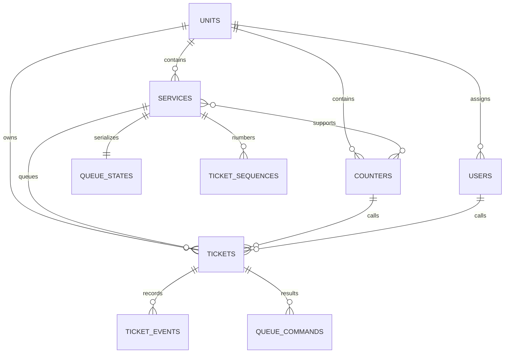

# Sistema Chamador de Senhas

Aplicação de gerenciamento e chamada de senhas para múltiplas unidades, serviços e guichês. Esta versão evolui o protótipo original em JavaScript puro para uma aplicação persistente, transacional e testada em Laravel 13 com React e TypeScript.


## Funcionalidades

- Totem público para emissão normal ou prioritária, sem coleta de dados pessoais.
- Comprovante responsivo preparado para impressão pelo navegador em papel de 80 mm.
- Painel do atendente com chamada, repetição, início, conclusão, ausência, retorno e cancelamento.
- Painel público para TV com últimas chamadas, relógio, Reverb, polling de recuperação, chime e `speechSynthesis` opcional.
- Administração de unidades, serviços, guichês, associações e usuários.
- Dashboard diário, filtros paginados e histórico imutável de transições.
- FIFO dentro de cada prioridade e alternância configurável sem starvation da fila normal.
- Idempotência persistente e locks transacionais para operações concorrentes.
- Login sem registro público, usuários ativos e papéis `admin` e `attendant`.

## Stack

- PHP 8.3+, Laravel 13, Fortify, Pest e Pint.
- Inertia 3, React 19, TypeScript estrito, Tailwind CSS 4 e shadcn/ui.
- MySQL, database queue, Laravel Reverb e Laravel Echo.
- Vitest, React Testing Library e Playwright.

## Requisitos

- PHP 8.3 ou superior com `pdo_mysql`, `pdo_sqlite`, `mbstring`, `openssl` e `pcntl` para os processos de desenvolvimento.
- Composer 2.
- Node.js 22 ou superior e npm.
- MySQL 8 para produção e CI. MariaDB compatível pode ser usado localmente.

## Instalação

```bash
git clone https://github.com/jonas-amilton/sistema-chamador-de-senhas.git
cd sistema-chamador-de-senhas
composer install
npm ci
cp .env.example .env
php artisan key:generate
```

Crie o banco. O identificador precisa de crases porque contém hífens:

```sql
CREATE DATABASE `chamador-senhas-mvp`
    CHARACTER SET utf8mb4
    COLLATE utf8mb4_unicode_ci;
```

Configure apenas o `.env` local. O arquivo é ignorado pelo Git e a senha não deve ser colocada no `.env.example`:

```dotenv
DB_CONNECTION=mysql
DB_HOST=127.0.0.1
DB_PORT=3306
DB_DATABASE=chamador-senhas-mvp
DB_USERNAME=jonas
DB_PASSWORD=<senha-local>
```

As credenciais acima são exclusivamente locais e não devem ser reutilizadas em produção.

Conclua a preparação:

```bash
php artisan migrate
php artisan db:seed
npm run build
```

O seeder é idempotente. Ele cria a **Unidade Principal**, o serviço **Atendimento Geral**, os guichês **Guichê 1** e **Guichê 2**, associa ambos ao serviço e, somente em `local`/`testing`, cria usuários de demonstração.

Credenciais padrão locais quando as variáveis `SEED_*` não estão definidas:

| Papel | E-mail | Senha |
|---|---|---|
| Administrador | `admin@example.test` | `SenhaDemo!123` |
| Atendente | `atendente@example.test` | `SenhaDemo!123` |

Defina `SEED_ADMIN_NAME`, `SEED_ADMIN_EMAIL`, `SEED_ADMIN_PASSWORD`, `SEED_ATTENDANT_NAME`, `SEED_ATTENDANT_EMAIL` e `SEED_ATTENDANT_PASSWORD` para substituir esses valores. Nunca use as credenciais de demonstração em produção.

## Desenvolvimento

O comando principal usa o agregador oficial do Laravel 13:

```bash
composer run dev
```

Ele inicia servidor HTTP, Vite, `queue:listen --tries=3`, Reverb e Pail. Para diagnóstico, execute separadamente:

```bash
php artisan serve
npm run dev
php artisan queue:work --tries=3 --backoff=1,5,15
php artisan reverb:start
php artisan pail
```

O MVP usa database queue e não exige Redis. Mantenha o worker em execução para distribuir broadcasts enfileirados.

## URLs

Com os dados iniciais:

- Totem: `http://localhost:8000/kiosk/unidade-principal`
- Painel público: `http://localhost:8000/display/unidade-principal`
- Atendente: `http://localhost:8000/attendant`
- Administração: `http://localhost:8000/admin`
- Health check: `http://localhost:8000/up`

## Política de fila

Cada serviço mantém FIFO independente para `standard` e `priority`. `priority_streak_limit` define quantas prioridades consecutivas podem ser chamadas quando também há senhas normais. Com limite `2`, duas prioritárias podem ser chamadas; a próxima chamada precisa ser normal se houver uma normal aguardando. Chamar uma normal zera `consecutive_priority_calls`. Se uma das filas estiver vazia, a outra continua normalmente.

As sequências reiniciam por unidade, serviço, prioridade e `business_date`. O dia operacional é calculado no timezone da unidade, com `America/Sao_Paulo` como padrão. Timestamps técnicos são armazenados em UTC. Códigos usam o prefixo configurado e largura mínima de quatro dígitos, sem limite em `9999`.

## Estados

Transições permitidas:

```text
waiting -> called | cancelled
called  -> serving | no_show | waiting | cancelled
serving -> completed | cancelled
no_show -> waiting | cancelled
```

`recall` mantém `called`, atualiza `last_called_at`, cria evento e retransmite a chamada. Não existe endpoint genérico de alteração de status; toda transição passa por uma Action específica.

## Arquitetura

- Controllers pequenos adaptam HTTP/Inertia.
- Form Requests validam entrada e autorização.
- Gates e `TicketPolicy` restringem papel, unidade e ticket.
- Actions executam casos de uso dentro de transações.
- Backed enums representam papéis, prioridades, estados, eventos e comandos.
- Eloquent models concentram relações, casts e scopes.
- `ticket_events` registra o histórico append-only.
- `TicketDisplayUpdated` implementa `ShouldDispatchAfterCommit` e `ShouldBroadcast`.
- O frontend usa Wayfinder, cliente HTTP com CSRF e um cliente Echo singleton.



Tabelas de domínio: `units`, `services`, `counters`, `counter_service`, `tickets`, `ticket_sequences`, `queue_states`, `ticket_events` e `queue_commands`. As tabelas padrão do Laravel armazenam usuários, sessões, cache e filas.

## Idempotência

Emissões usam `client_request_id` único. A repetição retorna o ticket original e não consome nova sequência.

Comandos operacionais usam `queue_commands.request_id`. `CommandExecutor` grava comando, hash do payload, alteração de estado, evento e resultado na mesma transação. O mesmo ID e payload reproduz o resultado; payload diferente retorna `409`. A constraint única também resolve duas inserções simultâneas da mesma chave.

## Concorrência

- A sequência diária é criada com upsert, bloqueada com `FOR UPDATE` e protegida por unique composto.
- `CallNextTicketAction` bloqueia o guichê e impede mais de um ticket `called`/`serving`.
- A linha de `queue_states` serializa a escolha do próximo ticket por serviço.
- O ticket escolhido é bloqueado e verificado novamente antes da transição.
- Deadlocks conhecidos têm no máximo três tentativas; não há retry infinito.
- Constraints únicas protegem sequência e idempotência mesmo fora da camada de aplicação.

A suíte `mysql-integration` usa processos PHP distintos e barreira de início. Ela não trata duas chamadas sequenciais como concorrência.

## Tempo real

O canal público é `units.{unitId}.display` e transmite somente evento, ticket, código, prioridade, serviço, guichê, horário e unidade. Não inclui e-mail ou metadados internos.

O banco é a fonte de verdade. Reverb distribui eventos após o commit, mas o display também:

- carrega o estado inicial por HTTP;
- consulta novamente após reconexão;
- faz polling de baixa frequência, padrão de 15 segundos;
- deduplica por `event_id`;
- cancela requisições obsoletas ao desmontar.

## Observabilidade

Operações críticas emitem logs estruturados com `request_id`, IDs do ticket, unidade, serviço, guichê, ator e estados anterior/novo. Conflitos de idempotência e falhas transacionais também são registrados. Senhas de usuário, cookies, tokens e sessão não são incluídos.

Falha de broadcasting não desfaz uma transação já confirmada. O worker registra jobs esgotados em `failed_jobs`, e o display recupera o estado por HTTP.

## Testes e qualidade

Suíte principal portátil em SQLite:

```bash
php artisan test --exclude-group=mysql-integration
```

Concorrência real em um banco MySQL **dedicado a testes**. O comando executa `migrate:fresh` e apaga esse banco:

```bash
RUN_MYSQL_INTEGRATION=true \
APP_ENV=testing \
DB_CONNECTION=mysql \
DB_DATABASE=queue_test \
BROADCAST_CONNECTION=null \
CACHE_STORE=array \
QUEUE_CONNECTION=sync \
SESSION_DRIVER=array \
php artisan test tests/Integration/MySql --group=mysql-integration
```

Frontend e qualidade:

```bash
vendor/bin/pint --test
vendor/bin/phpstan analyse
npm run lint:check
npm run format:check
npm run types:check
npm test
npm run build
```

E2E instala Chromium uma vez e recria o banco configurado antes do fluxo. Use somente banco de teste:

```bash
npx playwright install chromium
npm run test:e2e
```

O workflow `.github/workflows/ci.yml` executa Composer, Pest/SQLite, concorrência/MySQL 8.4, Pint, PHPStan, ESLint, Prettier, TypeScript, Vitest, build e Playwright em `push`, `pull_request` e `workflow_dispatch`.

## Segurança

- CSRF permanece ativo e todas as mutações usam Form Requests.
- Registro público está desabilitado e usuário inativo não autentica nem mantém sessão operacional.
- O totem possui rate limit configurável por `KIOSK_RATE_LIMIT`.
- Listagens administrativas usam filtros permitidos e paginação limitada.
- Entidades com histórico são desativadas; não há exclusão destrutiva administrativa.
- Senhas são hasheadas pelo cast do Laravel e nenhum segredo é versionado.
- Use HTTPS, cookies seguros, credenciais exclusivas, origins restritas do Reverb e processos supervisionados em produção.

Antes de publicar, configure cache de produção, banco e usuário dedicados, `APP_DEBUG=false`, `APP_ENV=production`, HTTPS, supervisor para queue/Reverb, rotação de logs, backup e monitoramento de `failed_jobs`. Execute `php artisan config:cache`, `php artisan route:cache`, `php artisan view:cache` e o build em processo de deploy.

## Limitações atuais

- Integração física com impressora térmica não faz parte deste MVP; o comprovante usa impressão do navegador.
- `speechSynthesis` depende do navegador. Quando indisponível, o painel mantém o chime e toda a informação visual/`aria-live`.
- O primeiro áudio exige ação explícita no botão **Ativar som**, respeitando as políticas de autoplay.
- Não há agendamento, dados pessoais de clientes, relatórios analíticos avançados ou integração externa.

## Projeto original e licença

Este trabalho começou como uma refatoração em JavaScript puro do projeto [SistemachamadordeSenhaJS](https://github.com/luisotavioosi/SistemachamadordeSenhaJS.git), criado por [Luis Teles](https://github.com/luisotavioosi/). A atribuição ao projeto original é preservada nesta evolução para Laravel e React.

Distribuído sob a [Licença MIT](LICENSE).
