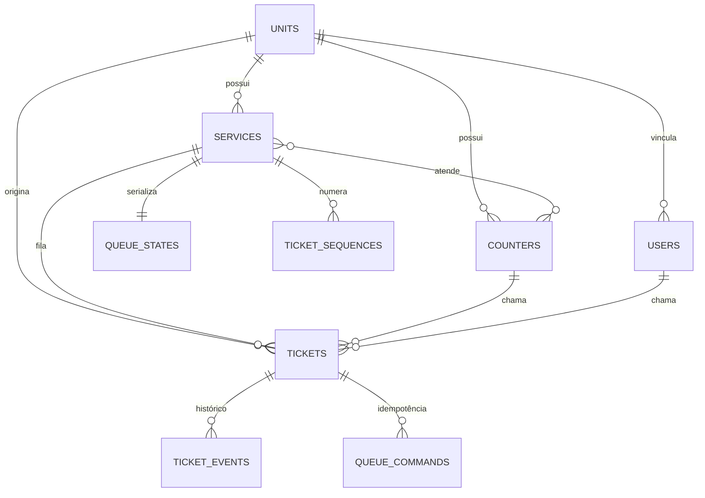

# Arquitetura — Sistema Chamador de Senhas

## Stack

| Camada | Tecnologia |
|---|---|
| Backend | PHP 8.3+, Laravel 13, Fortify |
| Frontend | React 19, TypeScript, Inertia 3, Tailwind CSS 4, shadcn/ui |
| Banco | MySQL (SQLite para testes portáteis) |
| Tempo real | Laravel Reverb + Laravel Echo |
| Filas | Database queue |
| Testes PHP | Pest |
| Testes JS | Vitest + React Testing Library |
| E2E | Playwright |
| Lint PHP | Pint (PHP CS Fixer) |
| Análise estática | PHPStan nível 7 |
| Lint JS | ESLint + Prettier |

---

## Diagrama de entidades



---

## Estrutura de diretórios

```
app/
  Actions/           Casos de uso transacionais (8)
    Concerns/        Trait HandlesTicketOperations
  Enums/             Backed enums (5)
  Events/            TicketDisplayUpdated
  Exceptions/        DomainConflictException, IdempotencyConflictException
  Http/
    Controllers/     Controllers HTTP/Inertia (13)
    Middleware/      EnsureUserIsActive
    Requests/        Form Requests (IssueTicket, CallNextTicket, TicketOperation, Admin/*)
  Models/            Eloquent models (9)
  Policies/          TicketPolicy
  Providers/         AppServiceProvider, FortifyServiceProvider
  Support/           CommandExecutor, TicketData

database/
  factories/         Factories (User, Unit, Service, Counter, Ticket, TicketEvent)
  migrations/        7 arquivos de migração
  seeders/           DatabaseSeeder (idempotente)

resources/js/
  components/        Componentes React + ui/ (shadcn)
  hooks/             use-appearance, use-mobile, use-current-url, use-clipboard, use-flash-toast
  layouts/           App, Auth, Settings
  lib/               http.ts, realtime.ts, utils.ts
  pages/             Páginas Inertia
    admin/           Dashboard, ticket-history
    attendant/       Painel do atendente
    display/         Painel público
    kiosk/           Totem, comprovante
    auth/            Login, forgot/reset-password, confirm-password
    settings/        Profile, security, appearance
  test/              setup Vitest
  types/             Tipos TypeScript (queue.ts, auth.ts, navigation.ts, ui.ts)

tests/
  Feature/           Testes Pest
    Auth/            Autenticação
    Http/            Endpoints HTTP
    Queue/           Actions de domínio
    Settings/        Perfil e segurança
  Integration/MySql/ Concorrência real MySQL
  E2E/               Playwright
```

---

## Fluxo de emissão

```
POST /kiosk/{unit}/tickets
  → IssueTicketRequest (validação)
  → IssueTicketAction::execute()
    1. Verifica idempotência (client_request_id único)
    2. Valida unidade e serviço ativos
    3. Calcula business_date no timezone da unidade
    4. Upsert + lockForUpdate em ticket_sequences
    5. Incrementa last_value
    6. Gera código (prefixo + sequência com 4 dígitos)
    7. Cria ticket (waiting)
    8. Cria ticket_event (issued)
    9. Commit da transação
    10. Log estruturado
  → JSON 201 com ticket + receipt_url
```

## Fluxo de chamada

```
POST /attendant/call-next
  → CallNextTicketRequest (autorização operate-queues)
  → CallNextTicketAction::execute()
  → CommandExecutor::execute()
    1. Verifica idempotência (request_id)
    2. Bloqueia counter (evita dois tickets ativos)
    3. Valida guichê ativo, serviço ativo e suportado
    4. lockForUpdate no counter (impede outra chamada)
    5. Bloqueia queue_states (serializa escolha)
    6. Busca ticket mais antigo (standard) e/ou (priority)
    7. Aplica priority_streak_limit
    8. lockForUpdate no ticket escolhido
    9. Confirma que ainda está waiting
    10. Atualiza ticket → called, counter_id, called_by_user_id, called_at, last_called_at
    11. Atualiza queue_states.consecutive_priority_calls
    12. Cria ticket_event (called)
    13. Grava queue_command com resultado
    14. Commit
    15. TicketDisplayUpdated::dispatch (after-commit)
    16. Log estruturado
  → JSON com ticket ou mensagem de fila vazia
```

---

## Idempotência

### Emissão

- `tickets.client_request_id` possui constraint `UNIQUE`
- Se o UUID já existe, a Action retorna o ticket original
- Se o UUID já existe com parâmetros diferentes (unidade/serviço/prioridade), retorna `409`

### Operações

- `queue_commands.request_id` possui constraint `UNIQUE`
- `CommandExecutor` persiste comando, hash do payload, alteração de estado e resultado na mesma transação
- Mesmo `request_id` + mesmo payload = **replay** (retorna o resultado original)
- Mesmo `request_id` + payload diferente = **409** (`IdempotencyConflictException`)

---

## Concorrência

| Cenário | Proteção |
|---|---|
| Duas emissões simultâneas | `ticket_sequences` unique composto + lockForUpdate |
| Dois atendentes chamando | lockForUpdate no counter + lockForUpdate no ticket |
| Mesmo request_id simultâneo | `queue_commands.request_id` UNIQUE + QueryException catch |
| Guichê ocupado | `activeAtCounter` scope + lockForUpdate |
| Deadlock | Até 3 tentativas (`DB::transaction(attempts: 3)`) |

A suíte `mysql-integration` valida esses cenários com processos PHP distintos e barreira de início.

---

## Tempo real

```
Canal público: units.{unitId}.display
Evento:        ticket.display.updated
Interface:     ShouldBroadcast + ShouldDispatchAfterCommit
```

O display (`display/index.tsx`):

1. Carrega estado inicial via `GET /display/{unit}/state`
2. Escuta Echo no canal público
3. Deduplica eventos por `event_id`
4. Após reconexão, consulta o servidor via HTTP
5. Polling de baixa frequência como fallback (padrão 15s)
6. Cancela requisições obsoletas ao desmontar

**Nunca transmite:** e-mail, dados pessoais, credenciais, tokens ou metadados internos.

---

## Autenticação e autorização

| Mecanismo | Implementação |
|---|---|
| Login | Fortify com `authenticateUsing` customizado (usuário ativo) |
| Registro | Desabilitado |
| Sessão inativa | Middleware `EnsureUserIsActive` → logout + redirect |
| Admin | Gate `can:admin` |
| Operações de fila | Gate `can:operate-queues` |
| Ticket específico | `TicketPolicy::operate()` (mesma unidade ou admin) |

---

## Observabilidade

Logs estruturados em todas as operações críticas com:
- `request_id`, `ticket_id`, `ticket_code`
- `unit_id`, `service_id`, `counter_id`, `actor_user_id`
- `previous_status`, `new_status`

Falhas de broadcasting registram log de erro sem desfazer transações já confirmadas.
